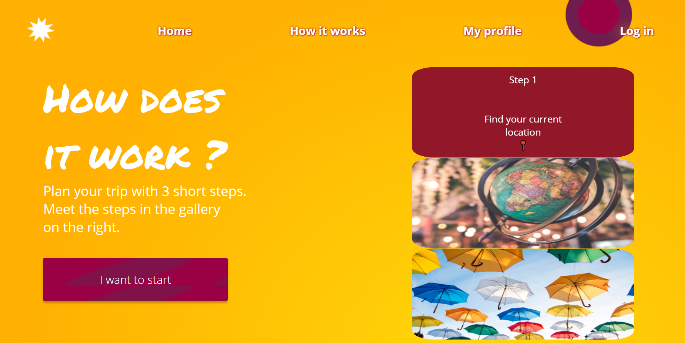
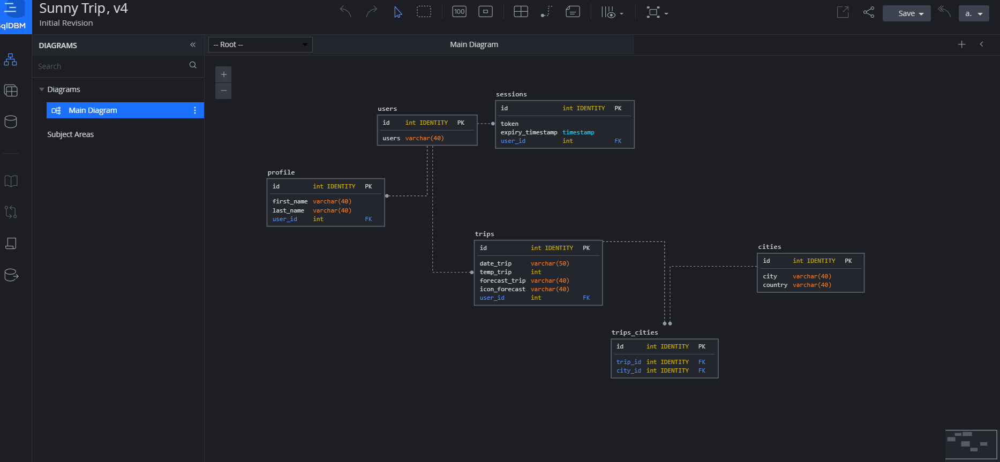
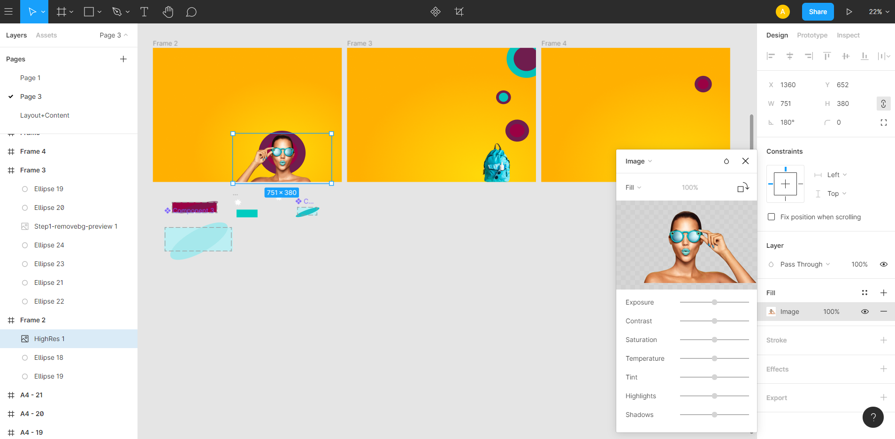

## Sunny trip

The App allows users to plan their trips based on preffered weather forecast, distance and date of the trip.

### Functionalities

- Users can create accounts, view, add, delete trips to their profile. Users can log in to these accounts and delete the profile.
- Users can plan trips with 3 short steps:
  - The App identifies your current location and shows it on the map.
  - The App finds nearby cities based on the preffered distance and minimum population.
  - The App shows the weather forecast in the next week in the selected city.

### Technologies

- Next.js, React.js
- PostgreSQL
- Database diagram with SqlDBM
- API Routes
- API fetching ([Weather API](https://openweathermap.org/api), [GeoDB API](http://geodb-cities-api.wirefreethought.com/))
- Authentification/authorization
- Design with Figma
- Libraries: google-map-react, nextcookies, ley, dotenv, cypress
- Deployed via Heroku

